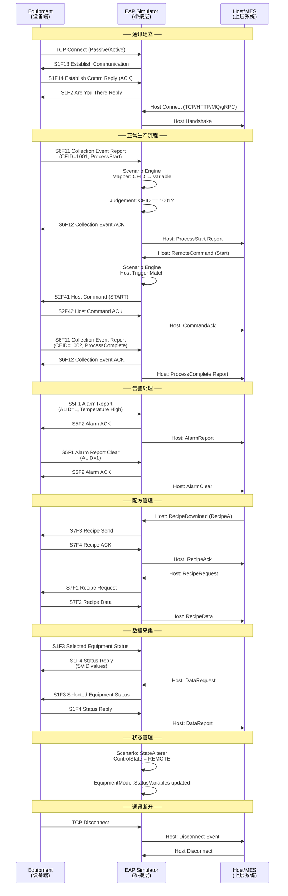

# EAP 三方通讯泳道图

## Equipment ↔ EAP ↔ MES 通讯流程



## 消息流向说明

| 方向 | 协议 | 说明 |
|------|------|------|
| Equipment → EAP | SECS/GEM (HSMS) | 设备事件、告警、状态上报 |
| EAP → Equipment | SECS/GEM (HSMS) | 远程命令、配方下载、状态查询 |
| EAP → MES | Host Protocol | 事件转发、告警通知、数据上报 |
| MES → EAP | Host Protocol | 远程命令、配方管理、数据请求 |

## 场景引擎在通讯中的角色

```
Equipment                    Scenario Engine                    MES
    │                              │                              │
    │──S6F11 (CEID)──►            │                              │
    │                    ┌────────┴────────┐                     │
    │                    │ 1. Mapper       │                     │
    │                    │    CEID → var   │                     │
    │                    │ 2. Judgement    │                     │
    │                    │    var == 1001? │                     │
    │                    │ 3. Host Action  │                     │
    │                    └────────┬────────┘                     │
    │                              │──── ProcessComplete ──────►│
    │◄──S6F12 ACK───              │                              │
    │                              │                              │
    │                              │◄── RemoteCommand ──────────│
    │                    ┌────────┴────────┐                     │
    │                    │ Host Trigger    │                     │
    │                    │ Match → Action  │                     │
    │                    └────────┬────────┘                     │
    │◄──S2F41 Command──           │                              │
    │──S2F42 ACK────►             │                              │
    │                              │──── CommandAck ───────────►│
```
